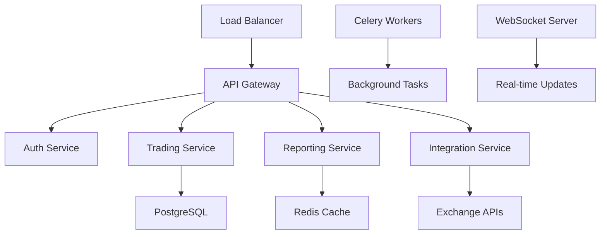

# 🚀 ROADMAP P2P Profit - Evolución hacia Web App

<div align="center">


[](README.md)
[](README.md)

**De Dashboard de Consola a Aplicación Web Profesional**

</div>

---

## 📊 Estado Actual del Sistema

### ✅ **Fortalezas Existentes**
- 🧮 **Lógica CPP sólida**: Cálculos precisos y auditables
- 📊 **Gestión de datos robusta**: CSV con validaciones
- 💱 **Soporte multi-moneda**: USD/UYU con tasas dinámicas
- 🔄 **Seguimiento de flujo**: Rastreo completo de fiat
- 🏦 **Integración Binance**: Comisiones automáticas
- 📈 **Reportes completos**: CSV con métricas detalladas
- 🛡️ **Seguridad**: Todo local, sin dependencias externas

### 🔄 **Limitaciones Actuales**
- 📟 **Interfaz de consola**: Limitada para usuarios no técnicos
- 📁 **Gestión manual de archivos**: CSV requiere edición manual
- 📊 **Visualizaciones básicas**: Solo texto en consola
- 🔒 **Acceso local único**: No multi-usuario ni remoto
- 📱 **Sin mobile**: No optimizado para dispositivos móviles
- 🌐 **Sin APIs**: No integración con exchanges en tiempo real

---

## 🎯 Objetivos Estratégicos

### 🏆 **Visión 2025**
> Convertir P2P Profit en la plataforma web líder para seguimiento de operaciones P2P cripto en América Latina

### 🎪 **Metas Principales**
1. 🌐 **Interfaz Web Moderna**: Dashboard responsive con React/Vue
2. 📊 **Visualizaciones Avanzadas**: Gráficos interactivos tiempo real
3. 🤖 **Automatización**: Integración APIs de exchanges
4. 👥 **Multi-usuario**: Soporte para equipos y empresas
5. 📱 **Mobile First**: App nativa iOS/Android
6. 🔗 **Integraciones**: APIs REST para terceros

---

## 🗓️ Cronograma de Desarrollo

## 📅 **FASE 1: Fundación Web (Q1 2025)**
*Duración: 3 meses | Prioridad: 🔴 CRÍTICA*

### 🎯 **Objetivos Fase 1**
- Migrar lógica backend a API REST
- Crear interfaz web básica funcional
- Mantener compatibilidad con sistema actual

### 🛠️ **Stack Tecnológico Seleccionado**

#### **Backend**
```python
🔧 Framework: FastAPI
📊 Base de datos: PostgreSQL + SQLAlchemy
🔄 Migraciones: Alembic
🛡️ Autenticación: JWT + OAuth2
📈 Caching: Redis
🧪 Testing: pytest + httpx
```

#### **Frontend**
```javascript
⚛️ Framework: React 18 + TypeScript
🎨 UI Library: Material-UI (MUI) v5
📊 Charts: Chart.js + react-chartjs-2
🔄 Estado: Zustand o Redux Toolkit
🌐 HTTP Client: Axios
📱 Mobile: Progressive Web App (PWA)
```

#### **DevOps & Deploy**
```yaml
🐳 Containerización: Docker + Docker Compose
☁️ Cloud: AWS/DigitalOcean
🔄 CI/CD: GitHub Actions
🌐 Proxy: Nginx
📊 Monitoring: Grafana + Prometheus
```

### 📋 **Tareas Específicas Fase 1**

#### **Semana 1-4: Setup Backend API**
- [ ] 🏗️ Estructurar proyecto FastAPI
- [ ] 🗄️ Diseñar esquema de base de datos
- [ ] 🔄 Migrar lógica de `script_p2p_tracker.py` a API
- [ ] 🛡️ Implementar autenticación básica
- [ ] 📊 Crear endpoints CRUD para compras/ventas
- [ ] 🧪 Tests unitarios backend (70% cobertura mínima)

#### **Semana 5-8: Frontend Base**
- [ ] ⚛️ Setup React + TypeScript
- [ ] 🎨 Implementar design system básico
- [ ] 📊 Dashboard principal con métricas clave
- [ ] 📝 Formularios para ingreso de datos
- [ ] 📈 Visualización básica de P&L
- [ ] 🔗 Integración con API backend

#### **Semana 9-12: Integración y Testing**
- [ ] 🔄 Migración de datos CSV existentes
- [ ] 🧪 Testing end-to-end con Cypress
- [ ] 🐳 Dockerización completa
- [ ] 🌐 Deploy en servidor de pruebas
- [ ] 📚 Documentación API con Swagger
- [ ] 🎯 Beta testing con usuarios existentes

### 🎁 **Entregables Fase 1**
- ✅ **API REST completa** con documentación Swagger
- ✅ **Web app funcional** con dashboard básico
- ✅ **Migración automática** de datos CSV
- ✅ **Deploy automático** con CI/CD
- ✅ **Documentación técnica** para desarrolladores

---

## 📅 **FASE 2: Experiencia de Usuario (Q2 2025)**
*Duración: 3 meses | Prioridad: 🟡 ALTA*

### 🎯 **Objetivos Fase 2**
- Mejorar UX/UI significativamente
- Implementar visualizaciones avanzadas
- Optimizar performance y usabilidad

### 📋 **Características Principales**

#### **🎨 UX/UI Avanzado**
- [ ] 🎨 **Design System completo** con componentes reutilizables
- [ ] 🌙 **Modo oscuro/claro** configurable
- [ ] 📱 **Responsive design** perfecto mobile/tablet/desktop
- [ ] ♿ **Accesibilidad WCAG 2.1** nivel AA
- [ ] 🎯 **Onboarding interactivo** para nuevos usuarios
- [ ] 🔍 **Búsqueda avanzada** y filtros inteligentes

#### **📊 Visualizaciones Interactivas**
```javascript
// Ejemplo de dashboard avanzado
const DashboardCharts = () => {
  return (
    <Grid container spacing={3}>
      <Grid item xs={12} md={6}>
        <ProfitLossChart data={plData} />
      </Grid>
      <Grid item xs={12} md={6}>
        <VolumeChart data={volumeData} />
      </Grid>
      <Grid item xs={12} md={4}>
        <ROIGauge value={roiValue} />
      </Grid>
      <Grid item xs={12} md={8}>
        <TradingTimeline transactions={transactions} />
      </Grid>
    </Grid>
  );
};
```

- [ ] 📈 **Gráficos P&L tiempo real** con zoom/pan
- [ ] 🎯 **KPI widgets** configurables
- [ ] 📊 **Heatmaps de rendimiento** por período
- [ ] 🔄 **Timeline interactivo** de transacciones
- [ ] 💰 **Calculadora ROI** en tiempo real
- [ ] 📋 **Reportes visuales** exportables

#### **⚡ Performance & Features**
- [ ] 🚀 **Lazy loading** para grandes datasets
- [ ] 💾 **Cache inteligente** con invalidación automática
- [ ] 🔄 **Real-time updates** con WebSockets
- [ ] 📤 **Importación masiva** CSV/Excel
- [ ] 📊 **Exportación avanzada** PDF/Excel con templates
- [ ] 🔔 **Notificaciones push** para alertas importantes

### 🎁 **Entregables Fase 2**
- ✅ **Interface moderna** con excelente UX
- ✅ **Dashboards interactivos** con métricas avanzadas
- ✅ **Performance optimizada** <2s load time
- ✅ **Mobile app PWA** instalable
- ✅ **Sistema de notificaciones** push

---

## 📅 **FASE 3: Automatización e Integraciones (Q3 2025)**
*Duración: 4 meses | Prioridad: 🟠 MEDIA*

### 🎯 **Objetivos Fase 3**
- Integrar APIs de exchanges principales
- Automatizar importación de datos
- Implementar alertas inteligentes

### 🔗 **Integraciones de Exchanges**

#### **APIs Prioritarias**
```python
# Ejemplo de integración Binance
class BinanceIntegration:
    def __init__(self, api_key: str, api_secret: str):
        self.client = BinanceClient(api_key, api_secret)
    
    async def sync_p2p_trades(self) -> List[Trade]:
        """Sincroniza trades P2P automáticamente"""
        trades = await self.client.get_p2p_trade_history()
        return [self.transform_trade(t) for t in trades]
    
    def transform_trade(self, trade: dict) -> Trade:
        """Convierte formato Binance a formato interno"""
        # Lógica de transformación...
```

- [ ] 🟡 **Binance P2P API** - Importación automática
- [ ] 🔵 **Coinbase Pro** - Para usuarios USD
- [ ] 🟠 **Kraken** - Mercado europeo
- [ ] 🟢 **Localbitcoins** - P2P tradicional
- [ ] 🔴 **Paxful** - P2P alternativo

#### **🤖 Automatización Inteligente**
- [ ] 🔄 **Sync automático** cada 15 minutos
- [ ] 🧠 **Detección duplicados** con ML
- [ ] 📊 **Reconciliación automática** con registros manuales
- [ ] 🎯 **Clasificación automática** de transacciones
- [ ] 📈 **Cálculo CPP tiempo real** con cada nueva operación

#### **🚨 Sistema de Alertas**
```typescript
interface AlertConfig {
  type: 'profit_target' | 'loss_limit' | 'volume_threshold';
  threshold: number;
  enabled: boolean;
  notification_methods: ('email' | 'sms' | 'push')[];
}

// Ejemplos de alertas
const alertas = [
  { type: 'profit_target', threshold: 1000, message: 'Meta de profit alcanzada!' },
  { type: 'loss_limit', threshold: -500, message: 'Límite de pérdida alcanzado' },
  { type: 'volume_threshold', threshold: 10000, message: 'Alto volumen detectado' }
];
```

### 🎁 **Entregables Fase 3**
- ✅ **Integración completa** con 3+ exchanges
- ✅ **Sincronización automática** de datos
- ✅ **Sistema de alertas** configurable
- ✅ **Machine Learning** para detección de anomalías
- ✅ **APIs públicas** para desarrolladores

---

## 📅 **FASE 4: Plataforma Empresarial (Q4 2025)**
*Duración: 4 meses | Prioridad: 🟢 BAJA*

### 🎯 **Objetivos Fase 4**
- Soporte multi-usuario y equipos
- Funciones empresariales avanzadas
- Monetización y escalabilidad

### 👥 **Características Multi-Usuario**

#### **🏢 Gestión de Organizaciones**
```typescript
interface Organization {
  id: string;
  name: string;
  plan: 'starter' | 'professional' | 'enterprise';
  users: User[];
  roles: Role[];
  settings: OrganizationSettings;
}

interface Role {
  name: string;
  permissions: Permission[];
}

type Permission = 
  | 'view_all_transactions'
  | 'create_transactions' 
  | 'export_reports'
  | 'manage_users'
  | 'configure_integrations';
```

- [ ] 👥 **Multi-tenant architecture** segura
- [ ] 🔐 **Roles y permisos** granulares
- [ ] 🏢 **Gestión de equipos** y departamentos
- [ ] 📊 **Reportes consolidados** multi-usuario
- [ ] 🔍 **Auditoría completa** de acciones

#### **📈 Features Empresariales**
- [ ] 📋 **Workflows de aprobación** para transacciones grandes
- [ ] 🧾 **Facturación automática** y contabilidad
- [ ] 📊 **Business Intelligence** con Power BI integration
- [ ] 🔄 **API Enterprise** con rate limiting
- [ ] 📞 **Soporte prioritario** 24/7
- [ ] 🛡️ **Compliance** SOX, GDPR

### 💰 **Modelo de Monetización**

#### **📦 Planes de Suscripción**
```yaml
Starter: $29/mes
  - Hasta 1,000 transacciones/mes
  - 1 usuario
  - Reportes básicos
  - Soporte email

Professional: $99/mes
  - Hasta 10,000 transacciones/mes
  - 5 usuarios
  - Integraciones APIs
  - Reportes avanzados
  - Soporte chat

Enterprise: $299/mes
  - Transacciones ilimitadas
  - Usuarios ilimitados
  - White-label disponible
  - Consultoría incluida
  - Soporte telefónico 24/7
```

### 🎁 **Entregables Fase 4**
- ✅ **Plataforma multi-tenant** completa
- ✅ **Planes de suscripción** funcionando
- ✅ **Sistema de facturación** automático
- ✅ **API Enterprise** con documentación
- ✅ **Programa de partners** activo

---

## 📱 **FASE PARALELA: Mobile App Nativa**
*Duración: 6 meses | Inicio: Q2 2025*

### 🎯 **Objetivos Mobile**
- App nativa iOS/Android
- Funcionalidad offline
- Push notifications

### 📱 **Stack Mobile**
```javascript
// React Native + TypeScript
Framework: React Native 0.72+
Estado: Redux Toolkit + RTK Query
UI: React Native Elements
Navegación: React Navigation 6
Push: Firebase Cloud Messaging
Offline: Redux Persist + AsyncStorage
Charts: Victory Native
```

#### **🎯 Features Core Mobile**
- [ ] 📱 **Dashboard móvil** optimizado
- [ ] 📝 **Captura rápida** de transacciones con cámara
- [ ] 🔔 **Push notifications** inteligentes
- [ ] 📊 **Widgets iOS/Android** con métricas
- [ ] 💾 **Modo offline** con sincronización
- [ ] 📍 **Geolocalización** para tracking de trades

#### **🎨 UX Mobile Específico**
```jsx
// Ejemplo de UX móvil
const QuickAddTransaction = () => {
  return (
    <SwipeCard>
      <CameraView onScan={handleQRScan} />
      <VoiceInput onTranscript={handleVoiceInput} />
      <QuickForms presets={commonTransactions} />
    </SwipeCard>
  );
};
```

---

## 🛠️ Consideraciones Técnicas

### 🏗️ **Arquitectura del Sistema**

#### **Backend Architecture**


#### **Database Schema Evolution**
```sql
-- Migración de CSV a PostgreSQL
CREATE TABLE transactions (
    id UUID PRIMARY KEY DEFAULT gen_random_uuid(),
    user_id UUID REFERENCES users(id),
    type transaction_type_enum,
    amount DECIMAL(20,8),
    currency currency_enum,
    price DECIMAL(20,8),
    exchange_id UUID REFERENCES exchanges(id),
    created_at TIMESTAMP DEFAULT NOW(),
    metadata JSONB
);

-- Índices para performance
CREATE INDEX idx_transactions_user_date ON transactions(user_id, created_at);
CREATE INDEX idx_transactions_type ON transactions(type);
```

### 🔒 **Seguridad y Compliance**

#### **Security Stack**
- 🛡️ **Autenticación**: JWT + refresh tokens
- 🔐 **Autorización**: RBAC con políticas
- 🔒 **Encriptación**: AES-256 para datos sensibles
- 🌐 **HTTPS**: TLS 1.3 obligatorio
- 🛡️ **Rate Limiting**: Por usuario y endpoint
- 🔍 **Monitoring**: Logs de seguridad completos

#### **Compliance Requirements**
```python
class ComplianceService:
    """Manejo de compliance y auditoría"""
    
    def audit_transaction(self, transaction: Transaction) -> AuditLog:
        """Crear log de auditoría para cada transacción"""
        return AuditLog(
            action="transaction_created",
            user_id=transaction.user_id,
            data_hash=self.hash_sensitive_data(transaction),
            timestamp=datetime.utcnow(),
            ip_address=self.get_client_ip(),
            compliance_flags=self.check_compliance(transaction)
        )
```

### ⚡ **Performance y Escalabilidad**

#### **Optimizaciones Clave**
- 📊 **Database**: Particionado por fecha para grandes volúmenes
- 💾 **Caching**: Redis con TTL inteligente
- 🔄 **Background Jobs**: Celery para cálculos pesados
- 📈 **CDN**: Para assets estáticos
- 🚀 **Lazy Loading**: Para datasets grandes

#### **Métricas de Performance**
```yaml
Targets:
  API Response Time: <200ms (p95)
  Page Load Time: <2s
  Database Queries: <100ms
  Uptime: 99.9%
  Concurrent Users: 1000+
```

---

## 💰 Inversión y Recursos

### 👥 **Equipo Requerido**

#### **Fase 1-2 (6 meses)**
- 🔧 **Backend Developer** (Python/FastAPI) - 1 FTE
- ⚛️ **Frontend Developer** (React/TypeScript) - 1 FTE
- 🎨 **UI/UX Designer** - 0.5 FTE
- 🧪 **QA Engineer** - 0.5 FTE
- 🏗️ **DevOps Engineer** - 0.5 FTE

#### **Fase 3-4 (8 meses)**
- 📱 **Mobile Developer** (React Native) - 1 FTE
- 🤖 **ML Engineer** (para integraciones) - 0.5 FTE
- 🔒 **Security Specialist** - 0.5 FTE
- 📊 **Product Manager** - 1 FTE

### 💸 **Presupuesto Estimado**

```yaml
Desarrollo (14 meses):
  Salarios: $420,000
  Infrastructure: $24,000
  Herramientas/Licencias: $12,000
  Marketing: $36,000
  Legal/Compliance: $18,000
  
Total Inversión: $510,000

ROI Proyectado:
  Año 1: $180,000 (500 usuarios pagos)
  Año 2: $480,000 (1,500 usuarios)
  Año 3: $1,200,000 (4,000 usuarios)
```

### ☁️ **Infraestructura Cloud**

#### **AWS Stack Recomendado**
```yaml
Desarrollo:
  - EC2: t3.medium (API) + t3.small (DB)
  - RDS: PostgreSQL db.t3.micro
  - Redis: ElastiCache t3.micro
  - S3: Para assets y backups
  - CloudFront: CDN
  
Producción:
  - EC2: c5.large (API) x2 + Load Balancer
  - RDS: PostgreSQL db.r5.large con Multi-AZ
  - Redis: ElastiCache r5.large
  - S3: Multi-region
  - CloudWatch: Monitoring completo
  
Costo mensual estimado:
  Desarrollo: $200/mes
  Producción: $800/mes
```

---

## 📊 Métricas de Éxito

### 🎯 **KPIs Técnicos**
- ⚡ **Performance**: API < 200ms, UI < 2s
- 🛡️ **Uptime**: 99.9% disponibilidad
- 🧪 **Quality**: 90%+ test coverage
- 🔒 **Security**: 0 vulnerabilidades críticas

### 📈 **KPIs de Producto**
- 👥 **Adopción**: 1000+ usuarios activos en 6 meses
- 🔄 **Engagement**: 70%+ usuarios activos mensualmente
- 💰 **Revenue**: $50K MRR en año 1
- ⭐ **Satisfacción**: 4.5+ estrellas en reviews

### 📊 **Métricas de Business**
```yaml
Q1 2025 (Fase 1):
  - Beta con 50 usuarios
  - Funcionalidad core 100% migrada
  - 0 critical bugs

Q2 2025 (Fase 2):
  - 300+ usuarios registrados
  - 150+ usuarios activos mensuales
  - Primera versión mobile (PWA)

Q3 2025 (Fase 3):
  - 1000+ usuarios registrados
  - Integración con 3 exchanges
  - $10K MRR

Q4 2025 (Fase 4):
  - 2500+ usuarios registrados
  - Planes enterprise activos
  - $35K MRR
```

---

## 🚨 Riesgos y Mitigaciones

### ⚠️ **Riesgos Técnicos**
| Riesgo | Probabilidad | Impacto | Mitigación |
|--------|--------------|---------|------------|
| 🔒 **APIs de Exchange cambien** | Alta | Medio | Abstraer integraciones, fallbacks |
| 📊 **Migración de datos compleja** | Media | Alto | Tests exhaustivos, rollback plan |
| ⚡ **Performance con grandes datasets** | Media | Alto | Optimización DB, caching avanzado |
| 🛡️ **Vulnerabilidades de seguridad** | Baja | Crítico | Auditorías regulares, bug bounty |

### 💼 **Riesgos de Negocio**
| Riesgo | Probabilidad | Impacto | Mitigación |
|--------|--------------|---------|------------|
| 🏆 **Competencia directa** | Alta | Alto | Diferenciación, features únicas |
| 📉 **Mercado cripto en crisis** | Media | Alto | Diversificación geográfica |
| 🏛️ **Cambios regulatorios** | Media | Medio | Compliance proactivo |
| 👥 **Dificultad encontrar talento** | Media | Alto | Remote team, equity compensation |

---

## 🏁 Próximos Pasos Inmediatos

### 📋 **Semana 1-2: Preparación**
- [ ] 🎯 **Validar roadmap** con stakeholders
- [ ] 👥 **Armar equipo** de desarrollo inicial
- [ ] 🛠️ **Setup entorno** de desarrollo
- [ ] 📊 **Análisis detallado** del código actual
- [ ] 🎨 **Mockups iniciales** de interfaz web

### 📋 **Semana 3-4: Kickoff Técnico**
- [ ] 🏗️ **Arquitectura detallada** backend
- [ ] 🗄️ **Diseño de base de datos** inicial
- [ ] ⚛️ **Setup proyecto React** con TypeScript
- [ ] 🐳 **Dockerización** del entorno
- [ ] 🧪 **Pipeline CI/CD** básico

### 📋 **Mes 2: Primeros Entregables**
- [ ] 🔗 **API REST funcional** para transacciones
- [ ] 📊 **Dashboard web básico** funcionando
- [ ] 🔄 **Migración automática** de datos CSV
- [ ] 🧪 **Tests e2e** básicos
- [ ] 🌐 **Deploy en staging** para pruebas

---

## 🤝 Conclusiones y Recomendaciones

### 🎯 **Recomendación Principal**
**Comenzar con Fase 1 inmediatamente** - La base sólida del sistema actual permite una migración progresiva sin interrumpir operaciones existentes.

### ✨ **Ventajas Competitivas Clave**
1. 🧮 **Metodología CPP probada** - Ventaja técnica real
2. 🌎 **Focus regional** (América Latina) - Market fit específico
3. 🔒 **Privacidad first** - Diferenciador importante
4. 📊 **Reporting avanzado** - Feature killer para empresas

### 🚀 **Factores de Éxito Críticos**
- 👥 **Equipo técnico sólido** desde día 1
- 🎨 **UX excepcional** para diferenciarse
- 🔄 **Feedback loop** constante con usuarios
- 📈 **Métricas de producto** desde el inicio
- 🛡️ **Seguridad como prioridad** en cada fase

### 🎪 **Impacto Esperado**
Al final del roadmap, P2P Profit será:
- 🏆 **La plataforma líder** para tracking P2P en LATAM
- 💰 **Negocio sostenible** con múltiples streams de revenue
- 🌐 **Tecnología escalable** lista para expansión global
- 👥 **Comunidad activa** de traders y empresas

---

<div align="center">

**[🚀 Comenzar Fase 1](#-fase-1-fundación-web-q1-2025)** • 
**[📊 Ver Métricas](#-métricas-de-éxito)** • 
**[💰 Presupuesto](#-inversión-y-recursos)**

---

[](README.md)

</div> 